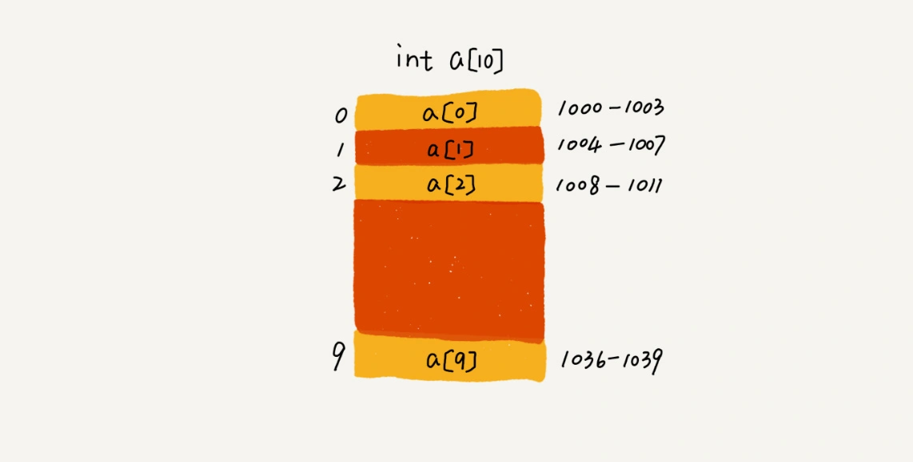

# 数组
> 数组是一种**线性表**数据结构，它用一组**连续的内存**空间，来存储一组具有**相同类型的数据**。

- 线性表：只有前后两个方向
  - 数组、队列、链表、栈。
- 非线性表：树、堆、图。

## 数组的随机访问
- `int[] a = new int[10]`
- 分配了一块连续内存空间 1000～1039
- 内存块的首地址为 base_address = 1000。
- `a[i]_address = base_address + i * data_type_size`
- data_type_size 表示数组中每个元素的大小

## 思考
- 低效的插入、删除
  - 数组为了保持内存数据的连续性，会导致插入、删除这两个操作比较低效。
    - 为了保证连续性，就需要做大量的数据搬移工作。
  - 假设数组 a[10]中存储了如下 5 个元素：a，b，c，d，e。
    - 我们现在需要将元素 x 插入到第 3 个位置。我们只需要将 c 放入到 a[5]，将 a[2]赋值为 x 即可。
  - 将多次删除操作集中在一起执行，删除的效率是不是会提高很多呢？
    - 避免数据被多次搬移
    - 垃圾回收算法的核心思想

- 数组和链表的区别？
  - 链表适合插入、删除，时间复杂度 O(1)；
  - 数组支持随机访问，根据下标随机访问的时间复杂度为 O(1)

- 为什么数组要从0开始，而不是1 ？
  - 从数组存储的内存模型上来看，“下标”最确切的定义应该是“偏移（offset）”
    - a[0] 就是偏移0的位置，a[k] 就是偏移k个位置
      - 如果从1开始 则寻址需要多一个 k-1 的过程
      - 数组作为非常基础的数据结构，效率要做到极致。
  - 历史原因，C语言设计者用0，后边效仿。

- 二维数组内存寻址：
  - 对于 m * n 的数组，`a [ i ][ j ] `(i < m,j < n)的地址为：
  - `address = base_address + ( i * n + j) * type_size`