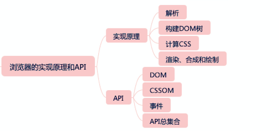

# 知识架构
> 要注意知识的完备性

> 程序 = 算法（执行过程） + 数据结构（类型）

## JavaScript

- 类型系统
  - 7种基本类型对应的是：
    - undefined、null、object、boolean、string、number、symbol。 
  - 7种语言类型应该对应的是: 
    - List和Record、Set、Completion Record、Reference、Property Descriptor、Lexical Environment和Environment Record、Data Block。
- 实例（内置对象）

## html & css

- 文档元信息：通常是出现在 head 标签中的元素，包含了描述文档自身的一些信息；
  - title、meta、style、link、base
- 语义相关：扩展了纯文本，表达文章结构、不同语言要素的标签；
  - section、nav
- 链接：提供到文档内和文档外的链接；
- 替换型标签：引入声音、图片、视频等外部元素替换自身的一类标签；
  - img、video、audio
- 表单：用于填写和提交信息的一类标签；
  - input、button
- 表格：表头、表尾、单元格等表格的结构。
- 实体、命名空间
- ARIA（在可访问性领域，它有至关重要的作用。）

## 浏览器的实现原理和API

## 前端工程实践

- 性能：对任何一个前端团队而言，性能是它价值的核心指标
- 工具链：作为开发阶段的入口，工具链又可以和性能、发布、持续集成等系统链接到一起，成为团队技术管理的基础。一致性
- 持续集成
- 搭建系统：针对高重复性、可模块化的业务需求，搭建系统是大部分大型前端团队的选择
- 架构与基础库
  - 软件架构师主要解决功能复杂性的问题
  - 服务端架构师主要解决高流量问题
  - 前端架构的主要职责是兼容性、复用和能力扩展。
