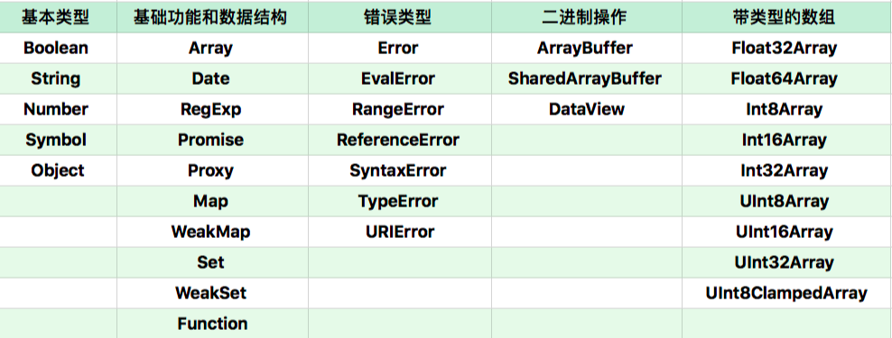

# JavaScript 对象

- 对象具有唯一标识性：即使完全相同的两个对象，也并非同一个对象。
- 对象有状态：对象具有状态，同一对象可能处于不同状态之下。
- 对象具有行为：即对象的状态，可能因为它的行为产生变迁。
  - 在 JavaScript 中，将状态和行为统一抽象为“属性”
  - JavaScript 赋予了使用者在运行时为对象添改状态和行为的能力。

## 数据属性

- value：就是属性的值。
- writable：决定属性能否被赋值。
- enumerable：决定 for in 能否枚举该属性。
- configurable：决定该属性能否被删除或者改变特征值。

```javascript
  // 我们通常用于定义属性的代码会产生数据属性，其中的 writable、enumerable、configurable 都默认为 true。
  var o = { a: 1 };
  o.b = 2;
  // a和b皆为数据属性
  // 我们可以使用内置函数 getOwnPropertyDescriptor 来查看，
  Object.getOwnPropertyDescriptor(o,"a") // {value: 1, writable: true, enumerable: true, configurable: true}
  Object.getOwnPropertyDescriptor(o,"b") // {value: 2, writable: true, enumerable: true, configurable: true}

  // 如果我们要想改变属性的特征，或者定义访问器属性，我们可以使用 Object.defineProperty，
  Object.defineProperty(o, "b", {value: 2, writable: false, enumerable: false, configurable: true});
```

## 访问器属性

- getter：函数或 undefined，在取属性值时被调用。
- setter：函数或 undefined，在设置属性值时被调用。
- enumerable：决定 for in 能否枚举该属性。
- configurable：决定该属性能否被删除或者改变特征值。

```javascript
  // 在创建对象时，也可以使用 get 和 set 关键字来创建访问器属性
  // 每次访问属性都会执行 getter 或者 setter 函数
  var o = { get a() { return 1 } }; 
  console.log(o.a); // 1

  // 当使用了getter或setter方法，不允许使用writable和value这两个属性。
  // Object.defineProperty()中不能同时设置访问器属性和value或者writable。
  // 数据描述符和存取描述符不能混合使用 //抛出错误 TypeError
  var obj = {};
  Object.defineProperty(obj,"newKey",{
      get:function (){} | undefined,
      set:function (value){} | undefined
      configurable: true | false
      enumerable: true | false
  });

```


## JavaScript 的原型
- `__prototype__`，就是对象的原型；
- 读一个属性，如果对象本身没有，则会继续访问对象的原型，直到原型为空或者找到为止。
- ES6 以来，JavaScript 提供了一系列内置函数，以便更为直接地访问操纵原型。三个方法分别为
  - Object.create 根据指定的原型创建新对象，原型可以是 null；
  - Object.getPrototypeOf 获得一个对象的原型；
  - Object.setPrototypeOf 设置一个对象的原型。

- new 操作具体做了哪些事？
  - 以构造器的 prototype 属性为原型，创建新对象；
  - 将 this 和调用参数传给构造器，执行；
  - 如果构造器返回的是对象，则返回，否则返回第一步创建的对象。


## JavaScript 对象分类

- 宿主对象
  - 由宿主环境提供的对象，它们的行为完全由宿主环境决定
    - window / new Image
- 内置对象（JavaScript语言提供的对象）
  - 固有对象
    - 随着运行时创建而自动创建的对象实例(类似基础库)
  - 原生对象
    - 用户通过 Array、RegExp等内置构造器创建的对象
  - 普通对象
    - 由{}、Object构造器、class关键字定义类创建的对象，能够被原型继承

### 原生对象



### 用对象来模拟函数与构造器
> 用 function 关键字创建的函数必定**同时是函数和构造器**。不过，它们表现出来的行为效果却并不相同。

- 函数的定义是：具有[[call]]私有字段的对象
- 构造器对象的定义是：具有私有字段[[construct]]的对象
  - 执行过程
    - 以 Object.prototype 为原型创建一个新对象；
    - 以新对象为 this，执行函数的[[call]]；
    - 如果[[call]]的返回值是对象，那么，返回这个对象，否则返回第一步创建的新对象。

```javascript
  // 如果我们的构造器返回了一个新的对象，那么 new 创建的新对象就变成了一个构造函数之外完全无法访问的对象，
  // 这一定程度上可以实现“私有”。
  function cls(){
      this.a = 100;
      return {
          getValue:() => this.a
      }
  }
  var o = new cls;
  o.getValue(); //100
  //a在外面永远无法访问到
```