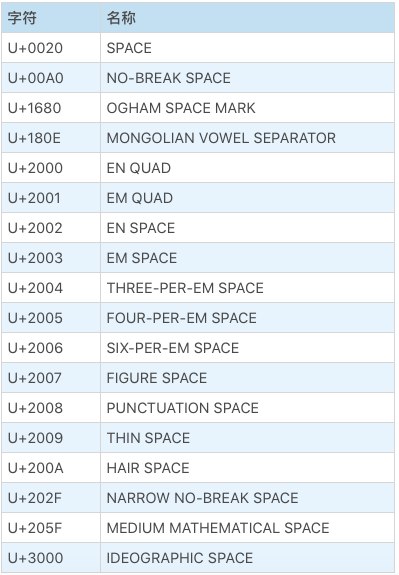

# JavaScript 词法

- WhiteSpace 空白字符
  - `<TAB> U+0009 \t`
  - `<VT> U+000B \v (垂直方向tab) `
  - `<FF> U+000C \f 分页符`
  - `<SP> U+0020 普通空格`
  - `<NBSP> U+00A0 非断行空格`
    - 在文字排版中，可以避免因为空格在此处发生断行，其它方面和普通空格完全一样。
    - `&nbsp;`最后生成的就是它了
  - `<ZWNBSP> U+FEFF 是 Unicode 中的零宽非断行空格`
- LineTerminator 换行符
  > 大部分在被词法分析器扫描出之后，会被语法分析器丢弃
  > 
  > 但是换行符会影响 两个重要语法特性：自动插入分号和“no line terminator”规则
  - `<LF>  U+000A \n 正常换行符`
  - `<CR>  U+000D \r   \r\n 真正意义上的“回车”`
  - `<LS>  U+2028 行分隔符`
  - `<PS>  U+2029 段落分隔符`
- Comment 注释
  - // SingleLineCommentChars
  - /* MultiLineCommentChars */
- Token 词
  - IdentifierName 标识符名称，典型案例是我们使用的变量名，注意这里关键字也包含在内了。
  - Punctuator 符号，我们使用的运算符和大括号等符号。
  - NumericLiteral 数字直接量，就是我们写的数字。
    - `12.toString() 报错` 这时候`12.` 会被当作省略了小数点后面部分的数字，而单独看成一个整体
    - `12 .toString()`
  - StringLiteral 字符串直接量，就是我们用单引号或者双引号引起来的直接量。
    - " DoubleStringCharacters " 
    - ' SingleStringCharacters '
      - 单双引号的区别仅仅在于写法
  - Template 字符串模板，用反引号` 括起来的直接量

```javascript
// 模板支持添加处理函数的写法，这时模板的各段会被拆开，传递给函数当参数：
function f(){
    console.log(arguments);
}

var a = "world"
f`Hello ${a}!`; // [["Hello", "!"], world]
```

### 特别之处
- 除法和正则表达式冲突问题
  - JavaScript 的解决方案是定义两组词法，然后靠语法分析传一个标志给词法分析器，让它来决定使用哪一套词法。
- 字符串模板，这些代码是以“ } ” 结尾的，也就是说，这部分词法不允许出现“ } ”运算符
- 所以你在 JavaScript 标准中，可以看到四种定义：
  - InputElementDiv；
  - InputElementRegExp；
  - InputElementRegExpOrTemplateTail；
  - InputElementTemplateTail。


### 零宽空格
> 可以做隐形指纹


```javascript
// 零宽空格
var a = '\uFEFF',b = 'b', c = 'c', d = (b+a+c);
console.log(d); //bc
console.log(d.length); //3
console.log(d.indexOf(a)); //1
```


