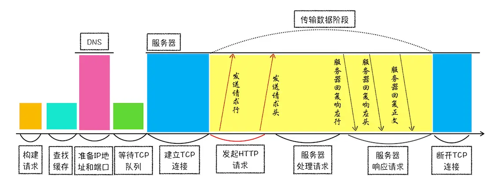
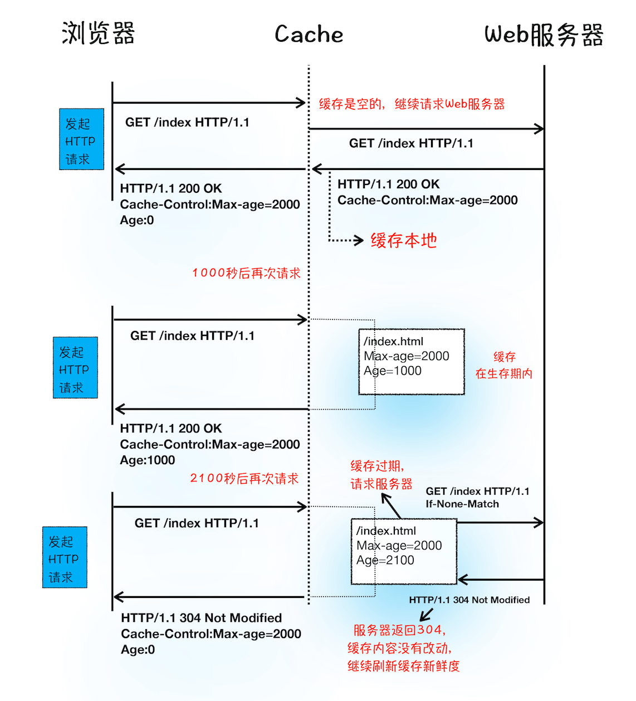

# 浏览器架构

## Chrome架构

### 进程&线程
- 进程
  - 一个进程就是一个程序的运行实例
    - 启动程序时，操作系统会为该程序创建一块内存，用来存放代码、运行中数据和一个执行任务的主线程，这个运行环境叫进程
  - 进程间通过IPC通信
- 线程
  - 依附于进程，由进程来启动和管理
  - 进程中使用多线程并行处理能提升运算效率
  - 线程可共享进程数据

### 架构
> 思考：为什么打开一个页面会有四个进程？

- 浏览器主进程
  - 负责界面展示、用户交互、子进程管理、提供存储等功能
- 渲染进程
  - 负责将HTML CSS JavaScript 转化为界面，排版引擎Blink、JS V8引擎就在这里
  - 默认会为每个tab创建一个渲染进程
  - 渲染进程中的所有内容都是通过网络获取，会存在恶意代码
    - 渲染进程运行在安全沙箱里，保证系统安全
- GPU进程
  - 负责绘制
  - 初衷是为了实现3D CSS 效果
- 网路进程
  - 负责进行网络资源加载
- 插件进程
  - 各种插件的运行

## TCP/IP 协议
> 思考：如何保证页面文件能被完整送达 ？

- IP 负责把数据包送达目的主机（网际协议 Internet Protocol）
- UDP 负责把数据包送达具体应用（用户数据包协议 User Datagram Protocol）
  - 不能保证数据可靠性，但传输速度非常快
    - 丢包、不保证顺序
  - 最重要的信息是 端口号（通过端口号把指定数据包发送给指定程序）
  - 每个想访问网络的程序都需要绑定一个端口号
- TCP 保证了数据完整传输（传输控制协议 Transmission Control Protocol）
  - 特点：
    - 面向连接的、可靠的、基于字节流
    - 提供重传机制
    - 数据包 排序机制，把乱序的数据包组合成一个完整的文件

### 一个数据包传输过程

- 一个数据包从主机A 发送给主机B
  - 数据包 （A 上层应用）
  - 附加 UDP 头（A 传输层）（或者TCP头，除了包含端口外，还包含用于排序的序列号）
    - 包含 目的端口、源端口号等信息
  - 附加 IP 头（A 网络层 ）
    - 包含IP版本、源IP地址、目标IP地址、生存时间等信息。
  - 底层（物理网络）
  - 解开数据包的IP头信息，将数据交给上层（B 网络层）
  - 解开数据包的UDP头信息，根据端口号把数据交给上层应用程序（B 传输层）
  - 数据包（到达B主机上层）

### TCP 生命周期

- 建立连接（三次握手）
  - 客户端和服务端总共要发送三个数据包来确认连接的建立。
- 传输数据
  - 接收端需要对每个数据包进行确认
    - 当发送数据包后，在规定时间内没收到确认消息，则触发重发机制
  - 接收端 按照TCP头中的序号排序，组成完整的数据
- 断开连接
  - 传输完毕，四次挥手，保证双方断开连接

## HTTP 协议
> 思考：为什么很多站点第二次打开速度会很快？

- HTTP协议作为应用层协议，用来封装请求的文本信息。
- HTTP的内容是通过TCP的传输来实现的

### HTTP流程

- 请求流程
  1. 构建请求
  2. 查找资源缓存
  3. 准备 IP地址(通过DNS 域名解析 来获取) 和 端口（默认 80）
  4. 等待 TCP 队列（同一个域名 同时只能建立6个TCP连接）
  5. 建立 TCP 连接
  6. 发送请求
- 返回流程
  1. 服务端处理后，返回请求
  2. 断开连接
  3. 特殊情况：重定向

#### HTTP请求
- 请求行
  - 请求方法
  - url
  - http 协议版本
- 请求头
  - 浏览器基础信息、请求的基本信息
- 请求体
  - 发送数据给服务器

#### HTTP响应
- 响应行
  - 协议版本
  - 状态码
    - 200 成功
    - 404 没有找到
- 响应头
  - 响应的基本信息：返回时间、类型、cookie等
- 响应体
  - 实际返回数据

#### DNS（域名系统）
> 把域名和IP地址做一一映射关系

- 浏览器请求DNS 返回域名对应IP
- 浏览器提供 DNS数据缓存服务
  - 某个域名已经解析过，就会缓存结果，下次减少一次网络请求。

#### 缓存
> 浏览器缓存是一种在本地保存资源副本，以供下次请求时直接使用的技术。

- 优势：缓解服务器端压力，提升性能（获取资源的耗时变短）
- 缓存查找
  - Cache-Control 设置是否缓存
    - Max-age  设置缓存过期时间
  - 缓存未过期：直接返回
  - 缓存过期：发情请求，http请求头携带 `If-None-Match:"4f80f-13c-3a1xb12a"`
    - 服务器会根据 If-None-Match的值来判断 请求资源是否有更新
    - 没有更新 则返回304 接着用缓存，刷新缓存新鲜度
    - 有更新 直接返回最新资源

#### 重定向
> 301 永久重定向 \ 
> 302 临时重定向

- 重定向的网址 是响应头 `Location` 字段