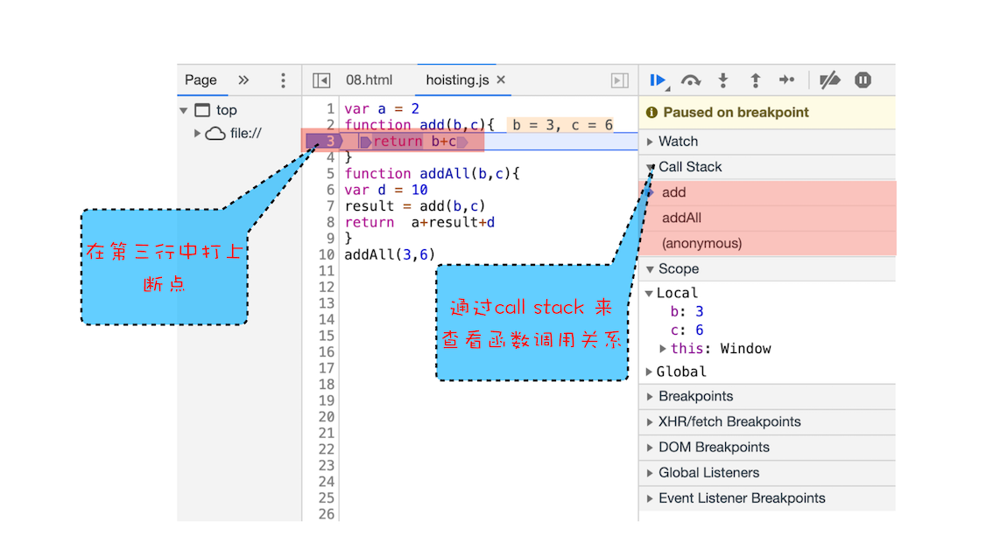
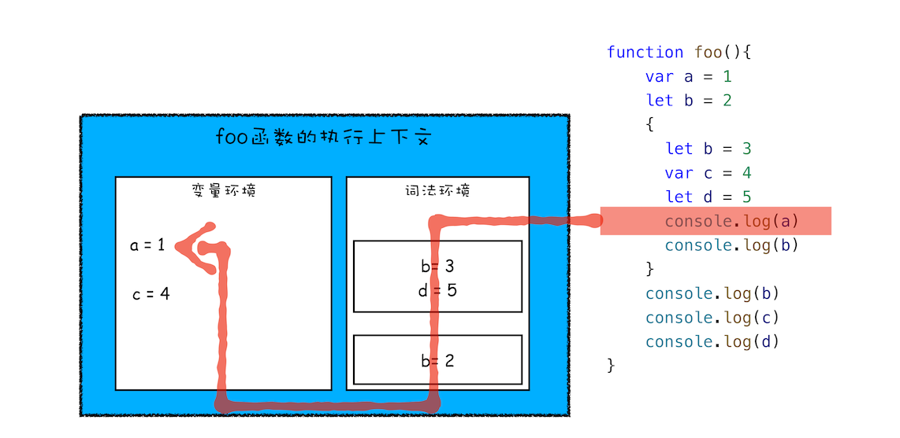
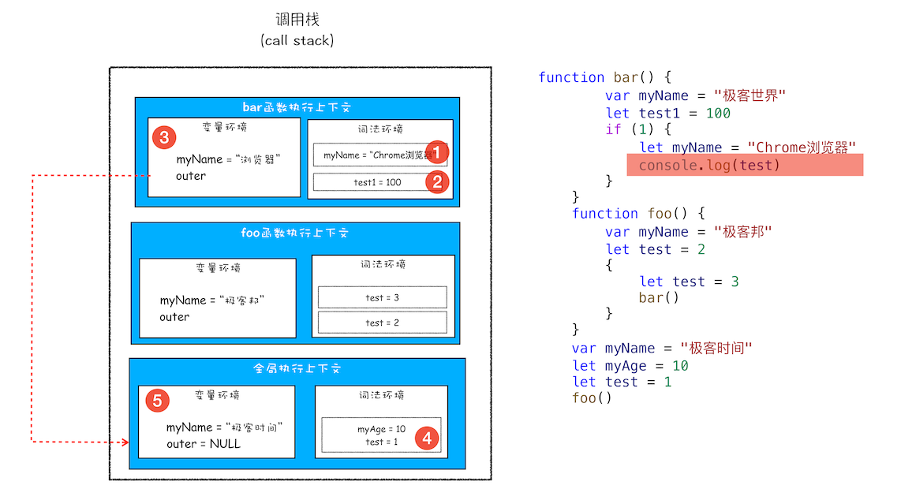
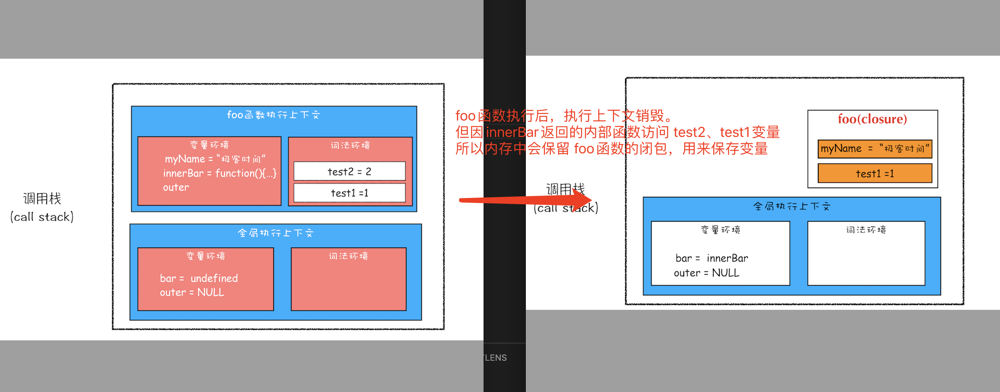
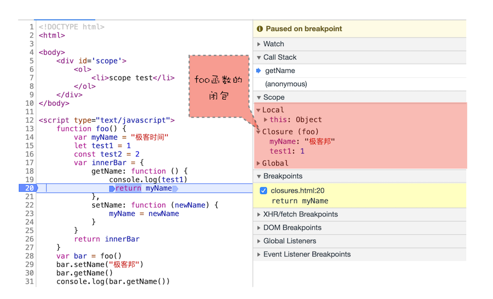

# 浏览器中 JavaScript 执行机制

## 执行上下文

### 变量提升（Hoisting）
> 是指在 JavaScript 代码执行过程中，JavaScript 引擎把**变量的声明部分和函数的声明部分**提升到代码开头的“行为”。\
> 变量被提升后，会给变量设置默认值，这个默认值就是我们熟悉的 undefined。

- 具体方式
  - var 声明的，因此 JavaScript 引擎将在环境对象中创建一个名为 myname 的属性，并使用 undefined 对其初始化；
  - function 定义的函数，所以它将函数定义存储到堆 (HEAP）中，并在环境对象中创建一个 showName 的属性，然后将该属性值指向堆中函数的位置

### 编译阶段
> js代码 => 编译 => 执行 \
> 在编译阶段被 JavaScript 引擎放入内存中

- 编译后 生成：
  - 执行上下文
    - 执行上下文是 JavaScript 执行一段代码时的运行环境
    - 在执行上下文中存在一个**变量环境的对象（Viriable Environment）**，该对象中保存了变量提升的内容
  - 可执行代码
    - 在执行阶段执行


### 创建执行上下文
- 执行全局代码时，会编译全局代码，创建全局执行上下文。
  - 在整个页面的生存周期内，只有一份
- 调用函数时，函数内代码会被编译，创建函数执行上下文，
  - 一般情况函数执行后被销毁
- 当使用eval函数时，eval代码会被编译，并创建执行上下文.
  - 函数会将传入的字符串当做 JavaScript 代码进行执行

## 调用栈
> 用来管理函数调用关系的数据结构(后进先出)

- 是JavaScript引擎追踪函数执行的一个机制
  - 在浏览器开发者工具，source标签 打断点 可查看调用栈信息
  - `console.trace()`输出 调用栈


### 栈溢出
> 栈是有大小的，当入栈的执行上下文超过一定数目，就会报错。\
> 超过了最大栈调用大小（Maximum call stack size exceeded）

- 递归导致栈溢出（参考[尾递归，蹦床函数](/docs/Base/11.尾递归.md)）
  - 修改递归调用形式
  - 加入定时器方法，把当前任务拆分成很多小任务

## 作用域 scope
> 变量与函数的可访问范围，决定了变量的生命周期。

- 全局作用域（可全局访问，伴随着页面生命周期）
- 函数作用域（函数内部，函数执行后内部变量会被销毁）
- 块级作用域
  - let、const

### JavaScript 是如何支持块级作用域的？
- 通过 var 声明的变量，在编译阶段存放刚到 **变量环境** 中。
- 通过 let 声明的变量，在编译阶段会存放到 **词法环境** 中。
  - 小型栈结构：进入一个作用域块，就会压入栈顶。

- 单个执行上下文，变量查找过程


### 暂时性死区
> 在块作用域内，let声明的变量被提升，初始化并没有被提升，在初始化之前使用变量，就会形成一个暂时性死区。

## 作用域链
> 其实在每个执行上下文的变量环境中，都包含了一个外部引用，用来指向外部的执行上下文，我们把这个**外部引用称为 outer**。

- 我们把通过作用域查找变量的链条称为作用域链
  - JavaScript 引擎首先会在“当前的执行上下文”中查找变量。
  - 如果在当前的变量环境中没有查找到，那么 JavaScript 引擎会继续在 outer 所指向的执行上下文中查找
- JavaScript 执行过程中，其作用域链是由**词法作用域**决定的。

### 词法作用域
> 是指作用域由代码中函数声明的位置来决定的。\
> 静态作用域，能够预测代码在执行过程中如何查找标识符

- 词法作用域是代码编译阶段就决定好的，和函数是怎么调用的没有关系。

- 作用域链中变量查找过程


## 闭包
> 内部函数总是可以访问外部函数中声明的变量。\
> 调用外部函数，返回一个内部函数，即使外部函数执行结束，但内部函数引用外部函数变量依然保存在内存中。 \
> 这些变量的集合成为闭包

- 闭包产生过程

- 闭包回收
  - 如果引用闭包的函数是个局部变量，等函数销毁后，在下次 JavaScript 引擎执行垃圾回收时，判断闭包这块内容如果已经不再被使用了，那么 JavaScript 引擎的垃圾回收器就会回收这块内存。
- 使用闭包原则
  - 如果该闭包会一直使用，那么它可以作为全局变量而存在；
  - 但如果使用频率不高，而且占用内存又比较大的话，那就尽量让它成为一个局部变量。

```javascript
function foo() {
  // 那么这些变量的集合就称为 foo 函数的闭包。
    var myName = "极客时间"
    let test1 = 1
    const test2 = 2
    var innerBar = {
        getName:function(){
            console.log(test1)
            return myName
        },
        setName:function(newName){
            myName = newName
        }
    }
    return innerBar
}
var bar = foo()
bar.setName("极客邦")
bar.getName()
console.log(bar.getName())
```



## this
> this 是和执行上下文绑定的，每个执行上下文 都有this

- 全局执行上下文中的this 指向window
- 函数执行上下文的this
  - 默认指向window（严格模式下  this是undefined）
  - 通过 call、bind、apply 来指定this指向
  - 使用对象调用其内部方法，该方法的this是指向对象本身的`obj.fun()`
  - 构造函数

### new 一个对象
```javascript

function CreateObj(){
  this.name = "极客时间"
}
var myObj = new CreateObj()
// new 一个对象，JavaScript引擎做了3件事：
// 1. 创建一个空对象 tempObj
// 2. 调用 CreateObj.call(tempObj) 将 CreateObj 执行上下文的this 指向 tempObj
// 3. 返回 tempObj
var tempObj = {}
CreateObj.call(tempObj)
return tempObj
```

### this 设计缺陷
- 嵌套函数中的this 不会从外层函数中继承 ，而是 window
  - 解决方案： 
    1. `let self = this` 
    2. 使用箭头函数
    3. 通过call方法 显示调用

### 箭头函数
> 箭头函数 没有自己的执行上下文 ，所以 this 是外层函数的 this