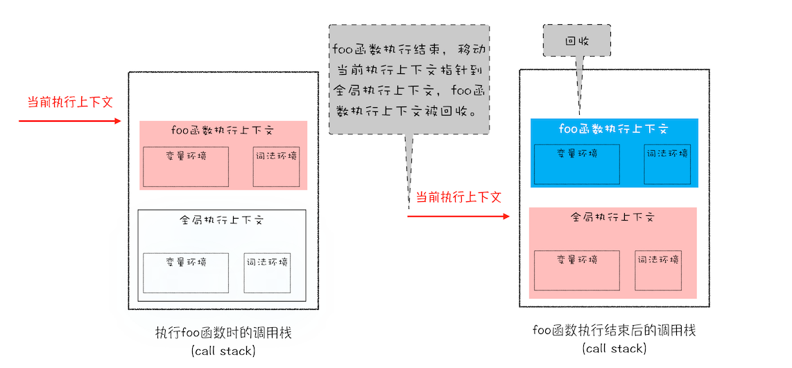
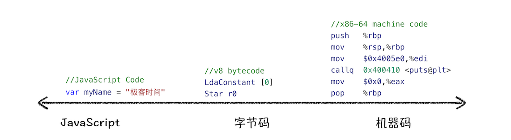
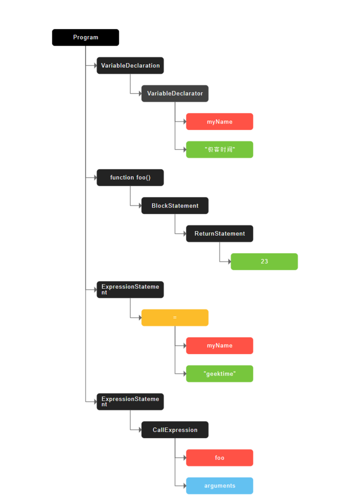

# V8 工作原理

## 数据是如何存储的

- JavaScript是动态、弱类型语言
  - 动态语言：运行中需要检查数据类型的语言
  - 弱类型：支持隐式类型转换
- 基本类型：
  - Null/Undefined/String/Number/BigInt/Boolean/Symbol
- 引用类型：
  - Object

### 内存空间
> 在js执行过程中，主要有三种类型空间：代码空间、栈空间、堆空间。

- 代码空间：主要是存储可执行代码的
- 栈空间（调用栈，存储执行上下文）：存放原始类型的小数据，及对象的引用地址
  - 栈空间用来维护程序执行期间的上下文状态，要保证上下文切换的效率，所以 **栈空间不会设置太大**
- 堆空间：存放引用类型的值
  - 堆空间很大，能存放很多大数据

- 调用栈中切换执行上下文状态


### 闭包的产生和存储
> 第一步是需要预扫描内部函数；\
> 第二步是把内部函数引用的外部变量保存到堆中。

1. 执行外部函数时，会创建一个执行上下文
2. 遇到内部函数时，对内部函数快速做一次词法扫描，如果引用了外部函数变量，则判断是一个闭包，
3. 在栈中变量环境创建一个 `closure(foo)`的内部对象，用来保存堆中的地址（闭包存在堆中）

- 闭包在执行外部函数时就已经产生了。
  - 当外部函数退出，但闭包依然被内部函数引用，所以在执行内部函数时，创建的执行上下文中就包含了`closure(foo)`

### 深拷贝

- 递归对象
  - 第三方库 Lodash(`_.cloneDeep(value)`)
- JSON序列化


## 垃圾回收

### 栈中的数据回收
> js引擎会通过向下移动 ESP 来销毁函数保存在栈中的执行上下文

- ESP: 记录当前执行状态的指针，指向当前执行上下文
- 下移ESP后，之前的执行上下文虽然还保存在栈中，但是已经是无效内存了，新的上下文会直接覆盖这块内存

### 代际假说
> 垃圾回收领域中的重要术语，后续垃圾回收策略都是建立在该假说基础之上。

- 第一个是大部分对象在内存中存在的时间很短，简单来说，就是很多对象一经分配内存，很快就变得不可访问；
- 第二个是不死的对象，会活得更久。

### 垃圾回收器

- 执行流程
  1. 标记可回收对象
  2. 回收被标记的可回收对象
  3. 内存整理
    - 频繁回收对象后，内存中就会存在大量不连续空间，我们把这些不连续的内存空间称为**内存碎片**

### 堆中的数据回收
> **新生代**中存放的是生存时间短的对象，**老生代**中存放的生存时间久的对象。

#### 新生代
> 通常只支持 1-8M 的容量，使用**副垃圾回收器**

- 使用 Scavenge 算法
  - 是把新生代空间对半划分为两个区域，一半是对象区域，一半是空闲区域
  - 新加入的对象都会存放到对象区域
  - 当对象区域快被写满时，就需要执行一次垃圾清理操作
    1. 标记可回收对象
    2. 把存活对象复制到空闲区，有序排列
    3. 对象区和空闲区互换
  - 对象晋升策略
    - 经过两次垃圾回收依然存活的对象，会被移到老生代

- 复制操作需要时间成本，所以为了执行效率，一般新生区的空间会被设置得比较小。


#### 老生代
> 使用**主垃圾回收器**

- 包含
  - 新生区晋升的对象（存活久的对象）
  - 占用空间大的对象

- 标记 - 清除（Mark-Sweep）算法
  - 标记阶段
    - 通过遍历调用栈
      - 没有找到的引用为垃圾数据
      - 找到引用的 标记为活动对象
  - 清除阶段
  - 执行后 会产生大量不连续的内存碎片，导致大对象无法分配
- 标记 - 整理（Mark-Compact）算法
  - 让所有存活的对象都向一端移动
  - 然后直接清理掉端边界以外的内存

### 全停顿（Stop-The-World）
> 由于 JavaScript 是运行在主线程之上的，一旦执行垃圾回收算法，都需要将正在执行的 JavaScript 脚本暂停下来，待垃圾回收完毕后再恢复脚本执行。

- 降低老生代的垃圾回收而造成的卡顿
  - 增量标记（Incremental Marking）算法
    - V8 将标记过程分为一个个的子标记过程，同时让垃圾回收标记和 JavaScript 应用逻辑交替进行，直到标记阶段完成


## 编译器和解释器

- 编译型语言
  - 经过编译器编译，生成机器能读懂的二进制文件，直接运行。
- 解释型语言
  - 在运行时通过解释器对程序动态解释、执行。


### V8是如何执行一段JavaScript代码的？
> [生成AST](https://resources.jointjs.com/demos/javascript-ast)


1. 将源代码转换为抽象语法树(AST)，并生成执行上下文
  - 编译器或者解释器后续的工作都需要依赖于 AST，而不是源代码
  - Babel 的工作原理就是先将 ES6代码 -> AST -> ES5 AST -> ES5代码
  - ESLint 原理：源码 -> AST -> 通过AST来检查代码规范
2. 生成字节码
  - 解释器 Ignition 
    - 根据 AST 生成字节码
    - 解释执行字节码
  - 字节码是介于AST和机器码之间的代码
3. 执行代码（即时编译JIT 具体到V8 则是 如下）
  - 解释器 Ignition 解释执行字节码
  - 编译器 TurboFan 把热点代码转换为高效的机器码



#### 生成AST

1. 分词 tokenize (词法分析)
  - 指的是语法上不可能再分的、最小的单个字符或字符串
2. 解析（parse），又称为语法分析，

```javascript

var myName = "极客时间"
function foo(){
  return 23;
}
myName = "geektime"
foo()
```



## js性能优化

- 提升单次脚本的执行速度，避免 JavaScript 的长任务霸占主线程，这样可以使得页面快速响应交互；
- 避免大的内联脚本，因为在解析 HTML 的过程中，解析和编译也会占用主线程；
- 减少 JavaScript 文件的容量，因为更小的文件会提升下载速度，并且占用更低的内存