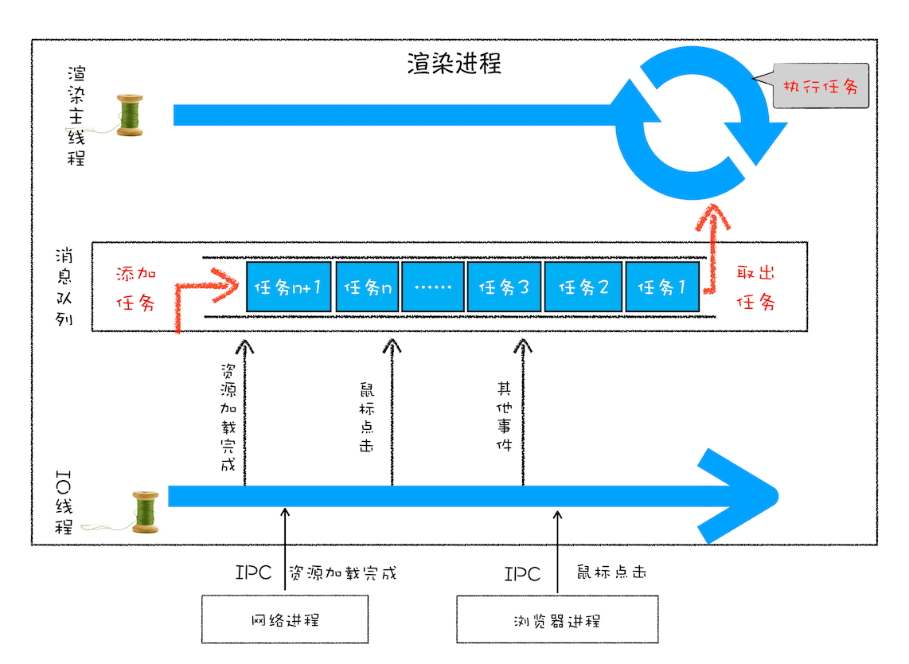
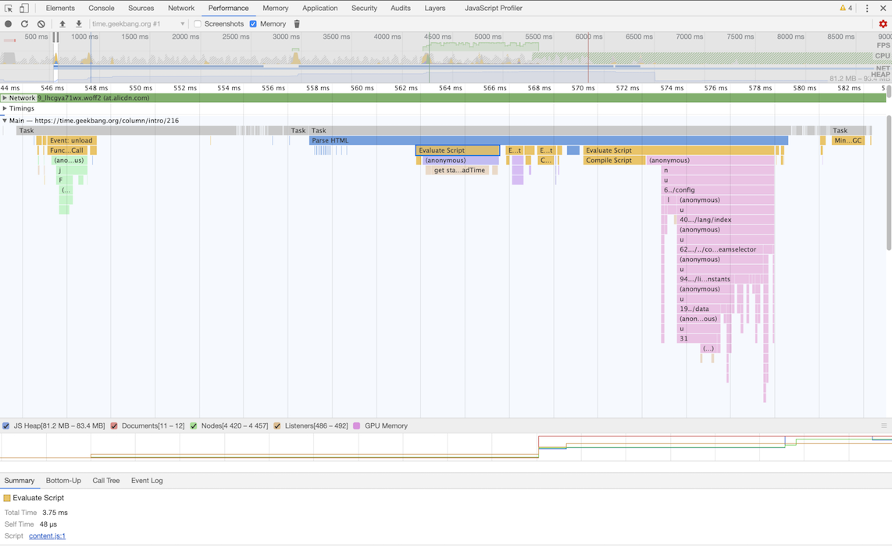
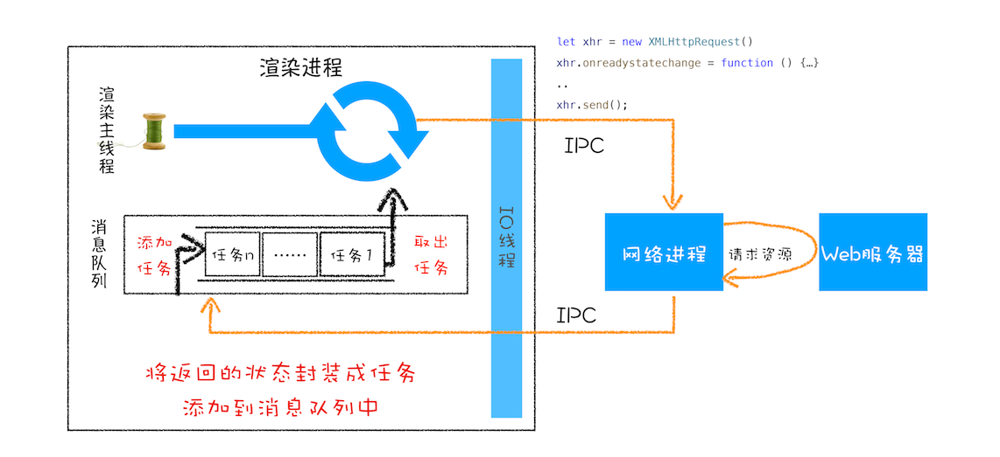
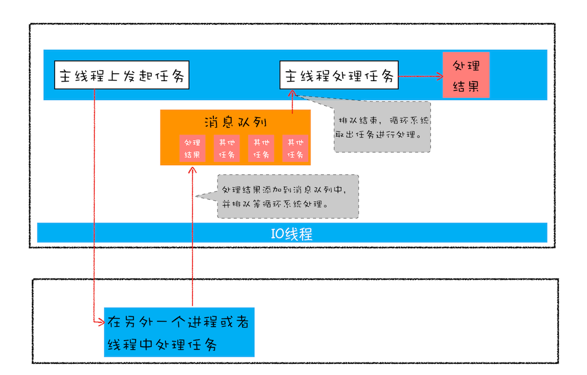
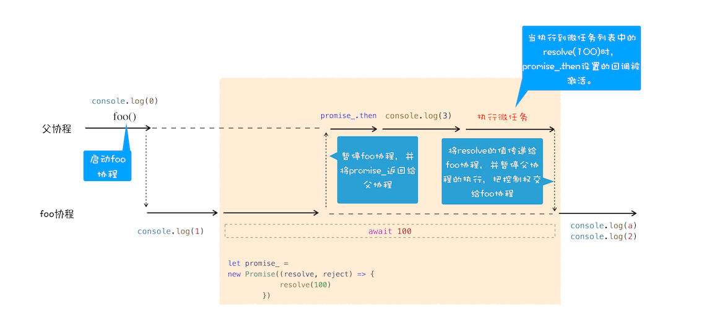

# 浏览器中的页面循环系统

## 页面循环
> 浏览器页面是由 消息队列 和 事件循环系统 来驱动的。

- 任务类型
  - 内部消息类型
    - 输入、滚动、点击、微任务、文件读写、webSocket、定时器等。
  - 页面相关事件
    - js执行、解析dom、样式计算、布局计算、CSS动画等



### 安全退出
> 确定要退出当前页面时，主线程会设置一个退出标志的变量，每次执行完一个任务时，判断是否有退出标志。\
> 如果有，则中断当前所有任务，退出线程。

### 消息队列的缺点

- 如何处理高优先级的任务？
  - 消息队列中的任务称为宏任务，每个宏任务包含一个**微任务队列**
  - 在宏任务执行过程中，如果dom有变化，那么将该变化添加到微任务列表中
  - 这样就不会影响宏任务执行（解决执行效率问题）
    - 宏任务主要功能执行完之后，执行当前宏任务中的微任务（解决实时性问题）
- 如何解决单个任务执行时间过长问题
  - 回调，让执行的js任务 滞后执行

### 页面生成过程
> 开发者工具 -> Performance -> start profiling and load page 记录页面加载过程

- 灰色的就是一个个任务，任务下还有子任务
- Parse HTML 任务 是 把HTML解析为DOM的任务，注意看 js阻塞 html解析


## setTimeout
> 一个定时器，用来指定某个函数在多少毫秒之后执行.
> 它会返回一个整数，表示定时器的编号，可以通过该编号来取消这个定时器. `clearTimeout(timer_id)`

- Chrome 维护了一个延迟执行的任务列表(hashmap结构)
  - 包括 定时器、 Chromium 内部一些需要延迟执行的任务
- 通过定时器发起的任务就被保存到延迟队列中

### 执行时机
> 每次执行完一个任务之后，会执行 ProcessDelayTask 函数 \
> ProcessDelayTask 函数会根据发起时间和延迟时间计算出到期的任务，然后依次执行这些到期的任务。
> 等到期的任务执行完成之后，再继续下一个循环过程。

```javascript

void ProcessTimerTask(){
  //从delayed_incoming_queue中取出已经到期的定时器任务
  //依次执行这些任务
}

TaskQueue task_queue；
void ProcessTask();
bool keep_running = true;
void MainTherad(){
  for(;;){
    //执行消息队列中的任务
    Task task = task_queue.takeTask();
    ProcessTask(task);
    
    //执行延迟队列中的任务
    ProcessDelayTask()

    if(!keep_running) //如果设置了退出标志，那么直接退出线程循环
        break; 
  }
}
```

### 注意事项

- 当前任务执行过久，会影响定时器任务的执行
  - js占用线程，定时器会在 js执行完成之后才执行，而不是设定好的时间
- 如果setTimeout存在嵌套调用，系统会设置最短间隔4毫秒
  - 定时器被嵌套调用 5 次以上
- 未激活的页面，setTimeOut 执行最小间隔是 1000毫秒
  - 目的是为了优化后台页面的加载损耗以及降低耗电量
- 延迟时间最大值 24.8天
  - 32个bit来存储延时值的，最大 2147483647 毫秒 约 24.8天
  - 超过这个值 则为 0，会立即执行
- this指向
  - 箭头函数、bind

```javascript
// 前任务执行过久，会影响定时器任务的执行
function bar() {
    console.log('bar')
}
function foo() {
    setTimeout(bar, 0);
    // js执行完成之后才执行定时器
    for (let i = 0; i < 5000; i++) {
        let i = 5+8+8+8
        console.log(i)
    }
}
foo()

// setTimeout嵌套调用， 系统会设置最短间隔4毫秒
function cb() { setTimeout(cb, 0); }
setTimeout(cb, 0);
```

### requestAnimationFrame
> 实现动画效果

- 使用 requestAnimationFrame 不需要设置具体的时间，由系统来决定回调函数的执行时间
  - 回调函数是在页面刷新之前执行，
  - 跟着屏幕的刷新频率走，保证每个刷新间隔只执行一次，
  - 如果页面未激活的话，requestAnimationFrame 也会停止渲染，
- setTimeout函数执行的间隔时间不一定是约定好的间隔时间，还与当前事件循环中的任务执行的时间有关，如果执行的时间太长的话，setTimeout里面的函数将会被延迟执行。

## XMLHttpRequest
> 提供了从 Web 服务器获取数据的能力.

- 回调函数
  - 将一个函数作为参数传递给另外一个函数，那作为参数的这个函数就是回调函数
  - 同步回调
    - 在当前函数的上下文中执行
  - 异步回调
    1. 做成一个任务，添加到消息队列尾部
    2. 添加到微任务队列中，在任务末尾执行微任务



```javascript

 function GetWebData(URL){
    /**
     * 1:新建XMLHttpRequest请求对象
     */
    let xhr = new XMLHttpRequest()

    /**
     * 2:注册相关事件回调处理函数 
     */
    xhr.onreadystatechange = function () {
        switch(xhr.readyState){
          case 0: //请求未初始化
            console.log("请求未初始化")
            break;
          case 1://OPENED
            console.log("OPENED")
            break;
          case 2://HEADERS_RECEIVED
            console.log("HEADERS_RECEIVED")
            break;
          case 3://LOADING  
            console.log("LOADING")
            break;
          case 4://DONE
            if(this.status == 200||this.status == 304){
                console.log(this.responseText);
                }
            console.log("DONE")
            break;
        }
    }

    xhr.ontimeout = function(e) { console.log('ontimeout') }
    xhr.onerror = function(e) { console.log('onerror') }

    /**
     * 3:打开请求
     */
    xhr.open('Get', URL, true);//创建一个Get请求,采用异步


    /**
     * 4:配置参数
     */
    xhr.timeout = 3000 //设置xhr请求的超时时间
    // 设置响应返回的数据格式 默认 text
    // json、documnet、blob、arraybuffer
    xhr.responseType = "text" 
    // 添加自己专用的请求头属性
    xhr.setRequestHeader("X_TEST","time.geekbang")

    /**
     * 5:发送请求
     */
    xhr.send();
}
```

### XMLHttpRequest 问题

- 跨域问题
  - www.geekbang.org 和 time.geekbang.com 不属于一个域，访问就属于跨域访问了。
- HTTPS 混合内容的问题
  - HTTPS 包含了 HTTP 资源，通过 HTTP 加载的图像、视频、样式表、脚本等，都属于混合内容。
  - 发起http请求


## 宏任务&微任务
> 微任务可以在**实时性和效率**之间做一个有效的权衡

### 宏任务
> 消息队列中的任务 称为宏任务.

- 渲染事件（如解析 DOM、计算布局、绘制）；
- 用户交互事件（如鼠标点击、滚动页面、放大缩小等）；
- JavaScript 脚本执行事件；
- 网络请求完成、文件读写完成事件。

### 微任务
> 微任务就是一个需要异步执行的函数，**执行时机**是在主函数执行结束之后、当前宏任务结束之前。\
> WHATWG 把执行微任务的时间点称为**检查点**
> 执行一段脚本的时候，V8 会为其创建一个全局执行上下文，在创建全局执行上下文的同时，V8 引擎也会在内部创建一个微任务队列.

- 微任务的产生方式
  1. 使用 MutationObserver 监控某个 DOM 节点
    - 然后再通过 JavaScript 来修改这个节点，或者为这个节点添加、删除部分子节点，
    - 当 DOM 节点发生变化时，就会产生 DOM 变化记录的微任务。
  2. 使用 Promise，当调用 Promise.resolve() 或者 Promise.reject() 的时候，也会产生微任务。


## Promise
> Promise 解决的是异步编码风格的问题\
> 消灭嵌套调用\
> 合并错误处理



- Web 页面的单线程架构决定了**异步回调**
- 引发 **回调地狱**
  - 嵌套调用,下面任务依赖上面任务的请求结果.
  - 任务的不确定性,每个任务都要进行一次额外的错误处理

### 原理
- 解决嵌套循环
  - Promise 实现了回调函数的延时绑定
  - 将回调函数 onResolve 的返回值穿透到最外层.
- 合并错误处理
  - Promise 对象的错误具有“冒泡”性质，会一直向后传递，直到被 onReject 函数处理或 catch 语句捕获为止

### promise与微任务
> 由于 Promise 采用了回调函数延迟绑定技术，所以在执行 resolve 函数的时候，回调函数还没有绑定，那么只能推迟回调函数的执行。\
> 使用微任务, 既可以让 onResolve 延时调用, 又提升了代码的执行效率

## async/await
> 使用同步的方式去写异步代码. \
> Promise + 生成器\
> 底层: 微任务 和 协程应用

### 生成器(Generator)
> 生成器函数是一个带星号函数，而且是可以暂停执行和恢复执行的

#### 协程
> 协程是一种比线程更加轻量级的存在. \
> 可以把协程看成是跑在线程上的任务，一个线程上可以存在多个协程，但是在线程上同时只能执行一个协程

- 比如当前执行的是 A 协程，要启动 B 协程，那么 A 协程就需要将主线程的控制权交给 B 协程，这就体现在 A 协程暂停执行，B 协程恢复执行
- 如果从 A 协程启动 B 协程，我们就把 A 协程称为 B 协程的父协程。

```javascript

function* genDemo() {
    console.log("开始执行第一段")
    // 3. 当协程正在执行的时候，可以通过 yield 关键字来暂停 gen 协程的执行，并返回主要信息给父协程。
    // js引擎 会保存 gen 协程当前的调用栈信息，并恢复父协程的调用栈信息。
    // 如果遇到 yield 关键字，那么 JavaScript 引擎将返回关键字后面的内容给外部，并暂停该函数的执行。
    yield 'generator 2'

    console.log("开始执行第二段")
    yield 'generator 2'

    console.log("开始执行第三段")
    yield 'generator 2'

    console.log("执行结束")
    // 4. 协程在执行期间，遇到了 return 关键字，那么 JavaScript 引擎会结束当前协程，并将 return 后面的内容返回给父协程。
    return 'generator 2'
}

console.log('main 0')
// 1. 通过调用生成器函数 genDemo 来创建一个协程 gen，创建之后，gen 协程并没有立即执行。
let gen = genDemo()
// 2. 要让 gen 协程执行，需要通过调用 gen.next。
// 在父协程中执行 gen.next 时，JavaScript 引擎会保存父协程的调用栈信息，并恢复 gen 协程的调用栈信息。
console.log(gen.next().value)
console.log('main 1')
// 外部函数可以通过 next 方法恢复函数的执行。
console.log(gen.next().value)
console.log('main 2')
console.log(gen.next().value)
console.log('main 3')
console.log(gen.next().value)
console.log('main 4')
```
- 协程执行流程图


### async 
> 是一个通过**异步执行并隐式返回Promise** 作为结果的函数

```javascript
async function foo() {
    return 2
}
console.log(foo())  // Promise {<resolved>: 2}
```

### await

```javascript

async function foo() {
    console.log(1)
    // await 会默认创建一个 Promise 对象
    let a = await 100
    console.log(a)
    console.log(2)
}
console.log(0)
// foo 函数是被 async 标记过 会进入foo协程
foo()
console.log(3)
```
- async/await 执行流程图


