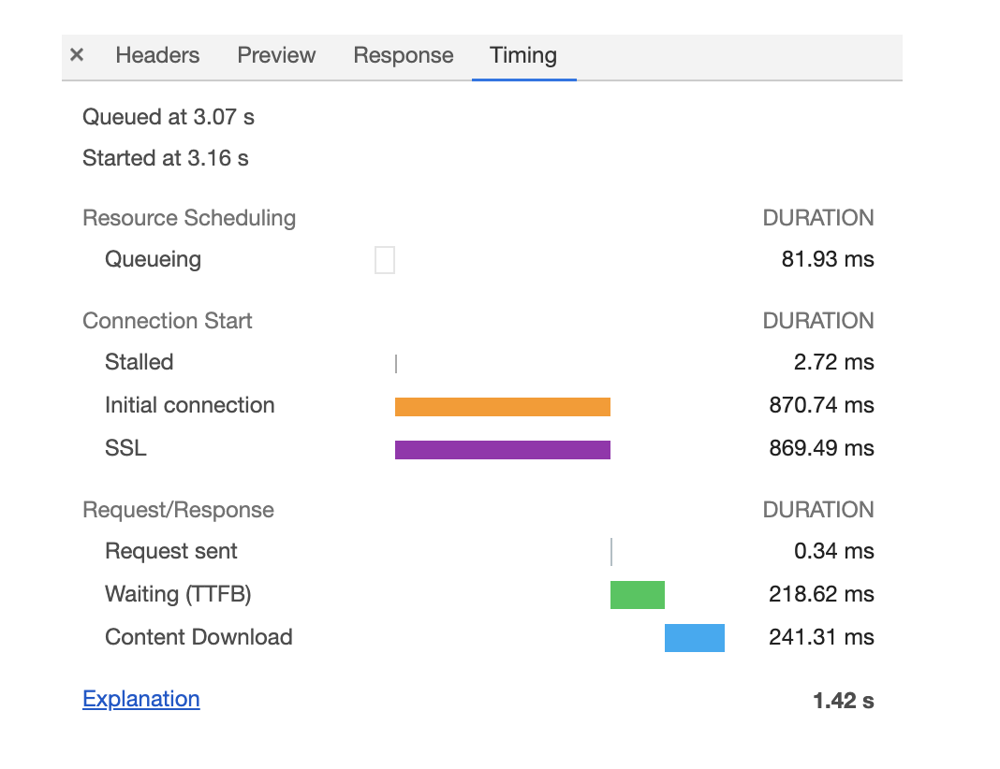
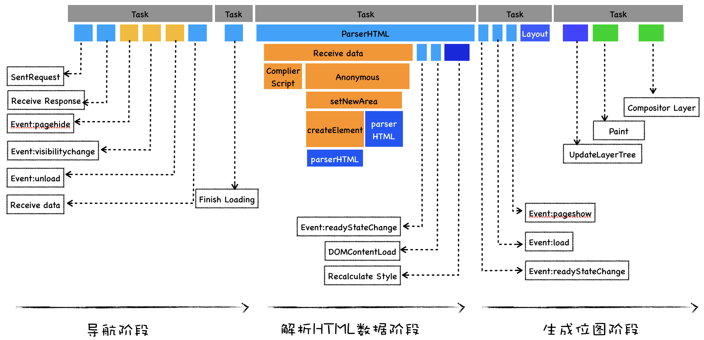

# Chrome 开发者工具

## 面板


### 网络面板


- 控制器


- 过滤器
  - 筛选所有下载文件内容
- 抓图信息
  - 分析用户等待页面加载时看到的内容
  - （勾选面板上的“Capture screenshots”即可启用屏幕截图。）
- 时间线
  - 主要用来展示 HTTP、HTTPS、WebSocket 加载的状态和时间的一个关系
  - 用于直观感受页面的加载过程。
  - 如果是多条竖线堆叠在一起，那说明这些资源被同时被加载。
- 详细列表
  - 记录了每个资源从发起请求到完成请求这中间所有过程的状态，以及最终请求完成的数据信息。
- 下载信息概要
  - DOMContentLoaded 和 Load 两个事件的完成时间。
    - DOMContentLoaded，这个事件发生后，说明页面已经构建好 DOM 了
    - Load，说明浏览器已经加载了所有的资源（图像、样式表等）。

#### 单个请求的时间线

- Timing 选项卡

  - Queuing，排队的意思,当浏览器发起一个请求的时候，会有很多原因导致该请求不能被立即执行，而是需要排队等待。
    - 页面中的资源是有优先级的
      - 比如 CSS、HTML、JavaScript 等都是页面中的核心文件，所以优先级最高；而图片、视频、音频这类资源就不是核心资源
    - 浏览器会为每个域名最多维护 6 个 TCP 连接
    - 网络进程在为数据分配磁盘空间时，新的 HTTP 请求也需要短暂地等待磁盘分配结束。
  - Stalled 停滞
    - 发起连接之前，还有一些原因可能导致连接过程被推迟，
  - Proxy Negotiation 代理协商阶段(如果使用了代理服务器)
  - Initial connection/SSL 阶段
    - 和服务器建立连接的阶段
      - 包括了建立 TCP 连接所花费的时间
      - SSL 握手时间，这个过程主要是用来协商一些加密信息的。
  - Request sent 阶段
    - 通常这个阶段非常快，因为只需要把浏览器缓冲区的数据发送出去就结束了,不到 1 毫秒。
  - Waiting (TTFB)
    - 第一字节时间(接收服务器第一个字节的数据)
    - TTFB 是反映服务端响应速度的重要指标
  - Content Download 阶段
    - 这意味着从第一字节时间到接收到全部响应数据所用的时间。

- 优化
  1. queuing 时间过久
    - 域名分片
      - 1 个站点下面的资源放在多个域名下面，比如放到 3 个域名下面，这样就可以同时支持 18 个连接了
    - 升级 HTTP2(不限制每个域名最多维护 6 个 TCP 连接)
  2. TTFB 时间过久
    - 服务器生成数据过久
      - 增加各种缓存的技术；
    - 网络原因
      - 使用 CDN 来缓存一些静态文件
    - 请求头带上了对于的cookie
  3. Content Download 时间过久
    - 这时候你就需要减少文件大小，比如压缩、去掉源码中不必要的注释等方法。


## 使用Audits(Lighthouse)来优化Web性能
> 什么是web性能? **web应用在浏览器上的加载和显示的速度**

- Chrome Canary 版的浏览器
  - 它的开发者工具和浏览器特性都是最新的
- 然后我们需要在 Chrome 的隐身模式下工作
  - 这样可以确保我们安装的扩展、浏览器缓存、Cookie 等数据不会影响到检测结果。

### Lighthouse
- 监测类型 (Categories)
  - 监测并分析 Web 性能 (Performance)；
  - 监测并分析 PWA(Progressive Web App) 程序的性能；
  - 监测并分析 Web 应用是否采用了最佳实践策略 (Best practices)；
  - 监测并分析是否实施了无障碍功能 (Accessibility)
  - 监测并分析 Web 应用是否采实施了 SEO 搜素引擎优化 (SEO)
- 设备类型 (Device)
  - Moblie
  - Desktop
- 生成报告 (Generate report)

#### 报告
- 第一部分 性能指标(Metrics)
  - View Trace 按钮
    - 点击该按钮可以跳转到 Performance 标签
- 第二部分 可优化项 (Opportunities)
  - 你可以对照 Audits 给的这些提示来优化你的 Web 应用。
- 第三部分 手动诊断 (Diagnostics)
  - 采集了一些可能存在性能问题的指标


- First Contentful Paint(当页面中绘制了第一个像素时)

- Speed Index(首屏时间)

- Largest Contentful Paint (首屏内容完全绘制完成时)
  - LCP 消耗时间过久，那么有可能是加载关键资源花的时间过久，
  - 也有可能是 JavaScript 执行过程中所花的时间过久，所以我们可以针对具体的情况来具体分析。

- Time to Interactive(完全可交互时间)
  - 解决 TTI 时间过久的问题，我们可以推迟执行一些和生成页面无关的 JavaScript 工作。

- Total Blocking Time(总阻塞时间)

- Cumulative Layout Shift(累计布局偏移)
  - 页面偏移程度
  - 范围是 0–1，其中 0 表示没有偏移，1 表示最大偏移。

## Performance
- 第一步是配置 Performance；
  - 设置该区域中的“Network”来限制网络加载速度，
  - 设置“CPU”来限制 CPU 的运算速度
- 第二步是生成报告页；
  - 黑色按钮是用来记录**交互阶段**性能数据
    - 如果你是录制交互阶段的性能时，那么需要手动停止录制过程。
  - 带箭头的圆圈形按钮用来记录**加载阶段**的性能数据
    - 当你录制加载阶段的性能数据时，Performance 会重新刷新页面，并等到页面完全渲染出来后，Performance 就会自动停止录制。
- 第三步就是人工分析报告页，并找出页面的性能瓶颈

- Performance报告页
> 通过概览面板来定位问题的时间节点，然后再使用性能面板分析该时间节点内的性能数据


- 概览面板
  - 页面帧速 (FPS)、CPU 资源消耗、网络请求流量、V8 内存使用量 (堆内存)
    - 如果 FPS 图表上出现了红色块，那么就表示红色块附近渲染出一帧所需时间过久，帧的渲染时间过久，就有可能导致页面卡顿。
    - 如果 CPU 图形占用面积太大，表示 CPU 使用率就越高，那么就有可能因为某个 JavaScript 占用太多的主线程时间，从而影响其他任务的执行。
    - 如果 V8 的内存使用量一直在增加，就有可能是某种原因导致了内存泄漏
  - 加载过程中的几个**关键时间节点**，如 FP、LCP、DOMContentLoaded、Onload 等事件产生的时间点。这些关键时间点体现在了几条不同颜色的竖线上。
- 性能面板
  - Network 指标 网络记录展示了页面中的每个网络请求
  - Timings 指标，用来记录一些关键的时间节点在何时产生的数据信息
  - Frames 指标，也就是浏览器生成每帧的记录
    - 你可以点击对应的帧，然后在详细信息面板里面查看具体信息。
  - Interactions 指标，用来记录用户交互操作，比如点击鼠标、输入文字等交互信息。

  - Main 指标记录渲染主线程的任务执行过程，
  - Compositor 指标记录了合成线程的任务执行过程，
  - Raster 指标(光栅化线程池,可以看到它维护了多个线程)
  - GPU 指标记录了 GPU 进程主线程的任务执行过程。
  - Chrome_ChildIOThread 指标(IO线程:用来接收用户输入事件、网络事件、设备相关等事件)
  
- 详情面板
> 可以通过在性能面板中选中性能指标中的任何历史数据，然后选中记录的细节信息就会展现在详情面板中了。

### Main指标
> 记录渲染主线上所执行的全部任务，以及每个任务的详细执行过程。


- 每个灰色横条就对应了一个任务，灰色长条的长度对应了任务的执行时长。
  - 灰线下面的横条就是一个个过程，同样这些横条的长度就代表这些过程执行的时长。

- 单个任务解析

```javascript

function A(){
    A1()
    A2()
}
function Task(){
    A()
    B()
}
Task()
```

#### 分析页面加载过程


1. 导航阶段: 从网络进程接收 HTML 响应头和 HTML 响应体。
2. 解析 HTML 数据阶段: 主要是将接收到的 HTML 数据转换为 DOM 和 CSSOM。
3. 生成可显示的位图阶段: 主要是利用 DOM 和 CSSOM，经过计算布局、生成层树 (LayerTree)、生成绘制列表 (Paint)、完成合成等操作，生成最终的图片。