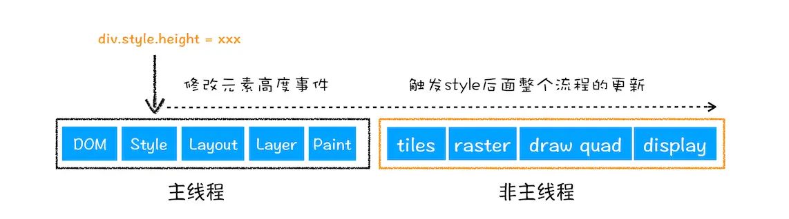
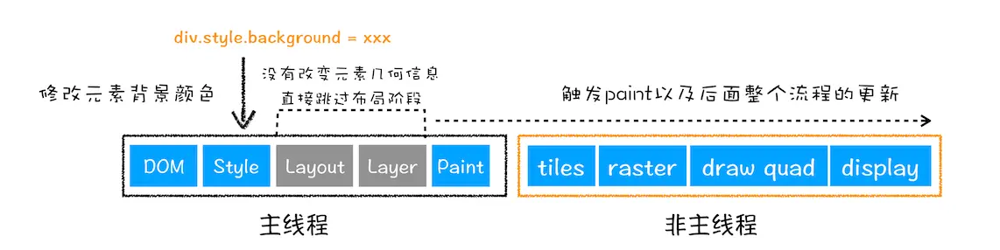

# 渲染流程
> 思考：HTML、CSS、JavaScript 是如何变成页面的？

1. 将HTML转换为DOM树
2. 将CSS转换为styleSheets
3. 创建布局树
4. 对布局树分层，生成分层树
5. 为图层生成绘制列表，提交到合成线程
6. 合成线程将图层分成图块，并在光栅化线程池中将图块转换成位图
7. 合成线程发送绘制图块命令 DrawQuad 给浏览器进程
8. 根据 消息生成页面，显示到显示器上

## 构建DOM树
> 浏览器无法直接理解和使用HTML，需要转换为DOM树（document）。

## 样式计算
> 计算出 DOM 节点中每个元素的具体样式

- 把CSS转换为浏览器能够理解的结构（document.styleSheets）
  - 来源：外部css、页内样式、行内样式
- 转换样式表中的属性，使其标准化
  - em -> px
  - color 使用 rgb
  - font-weight 使用数值
- 计算出 DOM 树中每个节点的具体样式
  - CSS继承规则
  - CSS层叠规则
    - 最终样式可查看：ComputedStyle

## 布局阶段
> 计算 DOM 树中**可见元素**的几何位置。\
> DOM + ComputedStyle => 生成布局树

- 创建布局树
  - 遍历DOM树中所有可见节点，添加到布局树
- 布局计算
  - 执行布局操作的时候，会把布局运算的结果重新写回布局树

## 分层
> 渲染引擎需要为特定的节点生成专用图层，生成一颗图层树（**LayerTree**）\
> 图层按照一定顺序叠加，就形成了最终的页面
> 可通过 Chrome开发者工具 Layers标签 查看分层情况

- 创建图层的条件:
  - 拥有层叠上下文属性的元素会被提升一层
    - postions、z-index、filter、opacity...
  - 需要裁剪的地方也会被创建为图层，如果出现滚动条，滚动条也会被提升为单独的层

## 图层绘制
> 把图层的绘制拆分成很多小的简单的绘制指令，在按照顺序组成一个待**绘制列表**。\
> 可通过 Chrome开发者工具 Layers标签 查看绘制列表，拖动进度条可重现列表的绘制。

- 实际上的绘制操作是由渲染引擎中的合成线程来完成的。
  - 当图层的绘制列表准备好后，主线程会把绘制列表提交给合成线程

- 视口（ViewPort）：屏幕上的可见区域
- 合成线程会将图层划分为图块（tile） 通常是 256\*256 或 512\*512 大小

## 栅格化
> 将图块转换为位图

- 按照视口附近的图块来优先生成位图
- 通常栅格化过程都会使用GPU来加速生成（快速栅格化），生成的位图保存在GPU内存中

## 合成和显示
> 所有图块被光栅化，合成线程会生成一个绘制图块的命令 **DrawQuad**，提交给浏览器进程 \
> 浏览器进程 viz组件 接收命令，绘制到内存，显示到屏幕上

# 相关概念
## 重排、重绘、合成

- 重排：更新了元素的几何位置属性
  - 需要更新完整的渲染流水线，开销最大

- 重绘：更新元素的绘制属性
  - 省去了布局和分层阶段，执行效率比重排高

- 合成：跳过布局和绘制 transform
  - 在非主线程上合成，不占用主线程资源
  - 避开布局和绘制，大大提升效率

## 思考题
- 如果下载CSS文件阻塞了，会阻塞DOM树的合成吗？会阻塞页面的显示吗？
  - 当从服务器接收HTML页面的第一批数据时，DOM解析器就开始工作了，如果遇到JS脚本，会先下载并执行js，在继续解析（**JS会阻塞DOM渲染**）
  - 如果js脚本中访问了某个元素样式，这时候需要等待这个样式被下载完成才能继续往下执行，这种情况下 **CSS也会阻塞DOM解析**