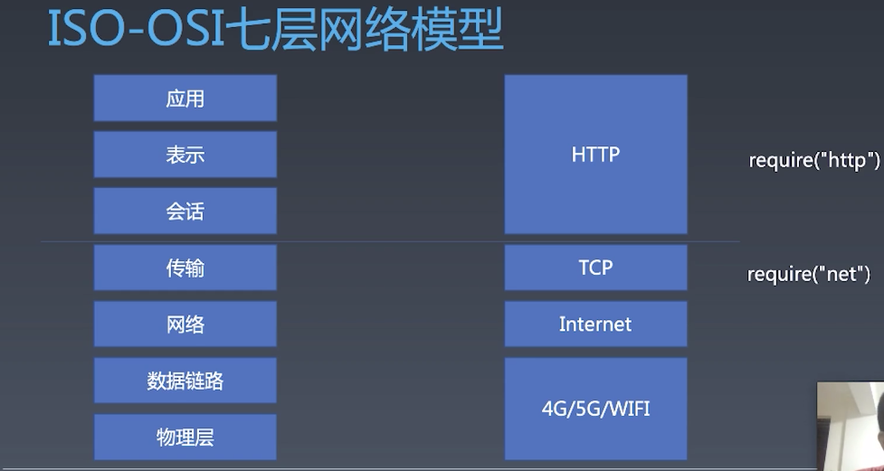
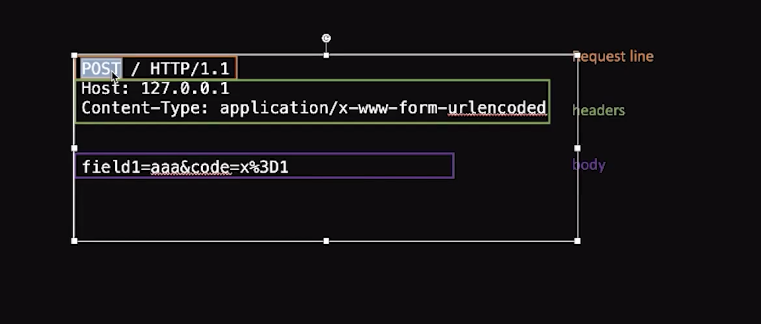
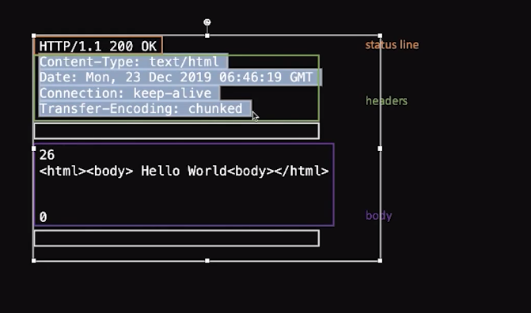
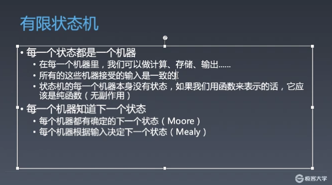

# 浏览器工作原理

- 输入URL后 发起HTTP请求
- 得到HTML返回后  进行解析
  - 通过有限状态机、在HTML标准中 已经规定了各种状态，先解析html 生成tag，通过栈的形式来生成dom树
- 生成Dom树 计算CSS
  - npm install css（AST）
    - 收集css规则 （在标签栈 pop之前收集 标签的中style样式）
    - 调用CSS Parser 来分析CSS规则 在创建一个元素后立即计算css
      - css计算会导致重排 重排必然导致重绘
      - 需要知道元素的所有父元素才能判断元素与规则是否匹配（通过stack来获取）最后一项匹配当前项
- 生成带样式的Dom with CSS树 后 进行layout 排版
- 排版后 进行位置计算 DOM with position 
- 计算后  进行render 生成 bitmap（内存中的一种图片）

## ISO-OSI七层网络模型


- TCP与IP
  - TCP（全双工通信）
    - 流式数据（收不到会重发）
    - 端口
    - require('net')
  - IP
    - 包
    - IP地址
    - libnet/libpcap
- HTTP（一问一答）
  - Request
  
  - Response
  


## 有限状态机


```javascript

// 简单的状态机
// 查找对应的字符串

function match(string) {
  let state = start;
  for (let c of string) {
      state = state(c);
  }
  return state === end;
}

function start(c) {
  if (c === 'a') {
      return foundA;
  } else {
      return start;
  }
}

function end(c) {
  return end;
}

function foundA(c) {
  if (c === 'b') {
      return foundB;
  } else {
      return start(c);
  }
}

function foundB(c) {
  if (c === 'c') {
      return foundC;
  } else {
      return start(c);
  }
}

function foundC(c) {
  if (c === 'd') {
      return foundD;
  } else {
      return start(c);
  }
}

function foundD(c) {
  if (c === 'e') {
      return foundE;
  } else {
      return start(c);
  }
}

function foundE(c) {
  if (c === 'f') {
      return end;
  } else {
      return start(c);
  }
}

console.log(match('123abcdddefwwabcdef'))

```


